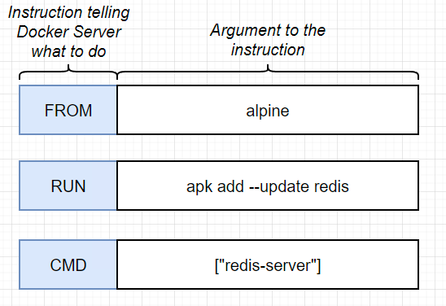

# docker-learning

leaning docker 101

# Creating-a-docker-file-flow

# Instruction Set

# Docker commands

## Basic Commands

- `docker --version`: Show the Docker version installed.
- `docker info`: Display system-wide information about Docker.
- `docker help`: Get help on Docker commands.

## Container Commands

- `docker ps`: List down all running containers.
- `docker ps -a`: List down all containers (running and stopped).
- `docker run -d --name <container-name> <image-name>`: Run a container in detached mode.
- `docker run -it <image-name> /bin/bash`: Run a container in interactive mode with a bash shell.
- `docker stop <container-id>`: Stop a running container.
- `docker start <container-id>`: Start a stopped container.
- `docker restart <container-id>`: Restart a running container.
- `docker rm <container-id>`: Remove a container.
- `docker logs <container-id>`: View the logs of a container.
- `docker exec -it <container-id> /bin/bash`: Execute a command in a running container.
